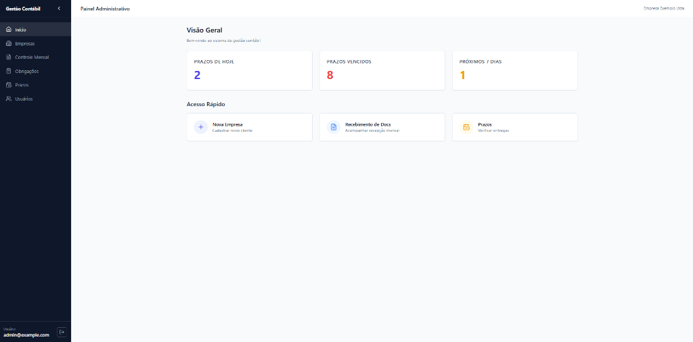
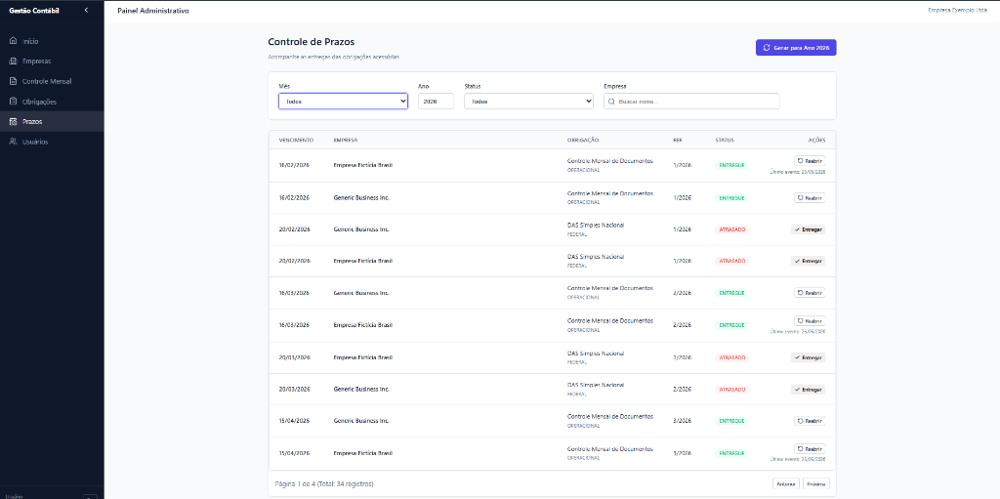
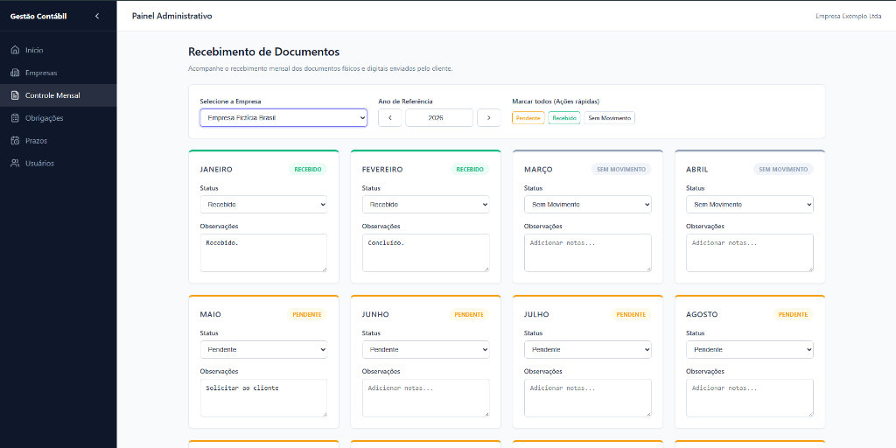
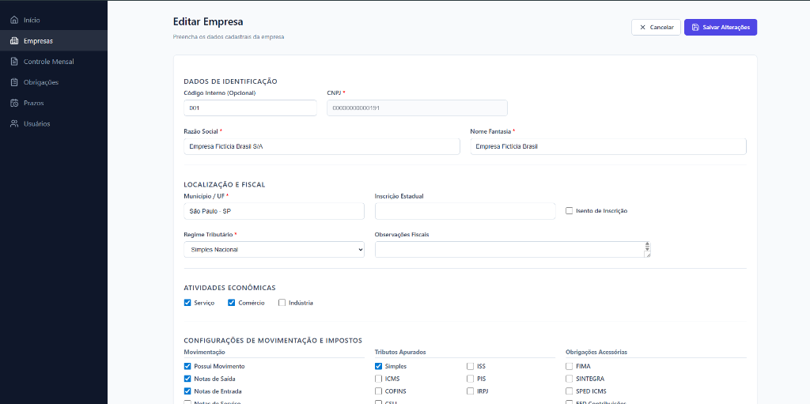
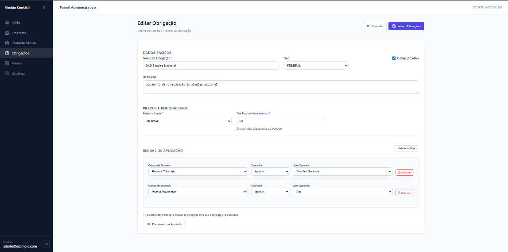

# Sistema de Gestão Contábil

🇧🇷 **Português** | 🇺🇸 [English](#accounting-document-management-system)

Um sistema web full-stack robusto para o gerenciamento de documentos financeiros e fiscais, voltado para escritórios de contabilidade.

## Funcionalidades
- **Gestão de Empresas**: Crie, edite, liste e inative empresas.
- **Controle Mensal**: Acompanhe o status dos documentos (Pendente, Entregue, Sem Movimento) por empresa/mês.
- **Autenticação**: Acesso seguro para Administradores utilizando JWT.
- **Dashboard**: Visão geral rápida das estatísticas do sistema e prazos pendentes.

## Telas do Sistema

### Visão Geral (Dashboard)


### Controle de Prazos


### Recebimento de Documentos


### Editar Empresa


### Editar Obrigação


## Tecnologias Utilizadas
- **Backend**: NestJS, TypeScript, Prisma, PostgreSQL
- **Frontend**: React, Vite, TypeScript, React Query
- **Infraestrutura**: Docker, Docker Compose

## Pré-requisitos
- Docker & Docker Compose
- Node.js (para desenvolvimento local sem Docker)

## Instalação e Execução

### Utilizando Docker (Recomendado)
1. Clone o repositório.
2. Crie um arquivo `.env` na pasta `backend/` (veja `backend/.env.example`).
3. Execute o comando:
   ```bash
   docker-compose up --build
   ```
4. Acesse:
   - Frontend: `http://localhost:5173`
   - Backend API: `http://localhost:3000`
   - Documentação da API: `http://localhost:3000/api`

### Desenvolvimento Local
**Backend**:
```bash
cd backend
npm install
npx prisma generate
npm run start:dev
```

**Frontend**:
```bash
cd frontend
npm install
npm run dev
```

---

# Accounting Document Management System

🇺🇸 **English** | 🇧🇷 [Português](#sistema-de-gestão-contábil)

A robust, full-stack web application for managing financial and fiscal documents for an accounting firm.

## Features
- **Company Management**: Create, edit, list, and inactivate companies.
- **Monthly Controls**: Track document status (Pending, Delivered, No Documents) per company/month.
- **Authentication**: Secure Admin access via JWT.
- **Dashboard**: Quick overview of system stats and pending deadlines.

## System Screenshots

### Dashboard


### Deadlines Control


### Document Receiving


### Edit Company


### Edit Obligation


## Tech Stack
- **Backend**: NestJS, TypeScript, Prisma, PostgreSQL
- **Frontend**: React, Vite, TypeScript, React Query
- **Infrastructure**: Docker, Docker Compose

## Prerequisites
- Docker & Docker Compose
- Node.js (for local dev without Docker)

## Setup & Running

### Using Docker (Recommended)
1. Clone the repository.
2. Create a `.env` file in `backend/` (see `backend/.env.example`).
3. Run:
   ```bash
   docker-compose up --build
   ```
4. Access:
   - Frontend: `http://localhost:5173`
   - Backend API: `http://localhost:3000`
   - API Docs: `http://localhost:3000/api`

### Local Development
**Backend**:
```bash
cd backend
npm install
npx prisma generate
npm run start:dev
```

**Frontend**:
```bash
cd frontend
npm install
npm run dev
```
